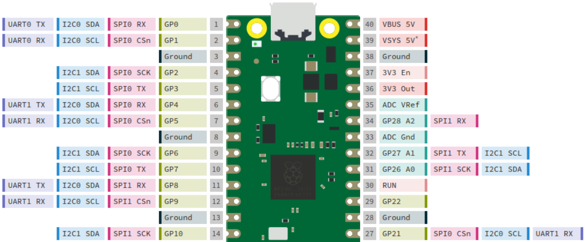
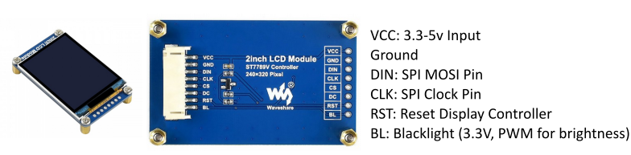
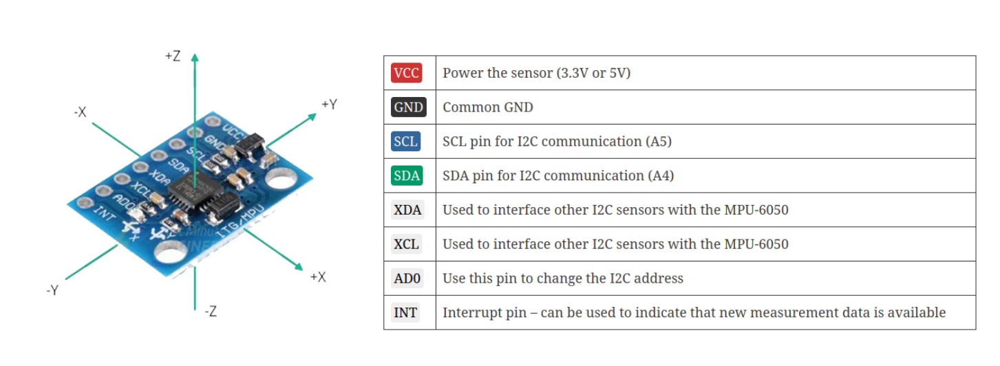
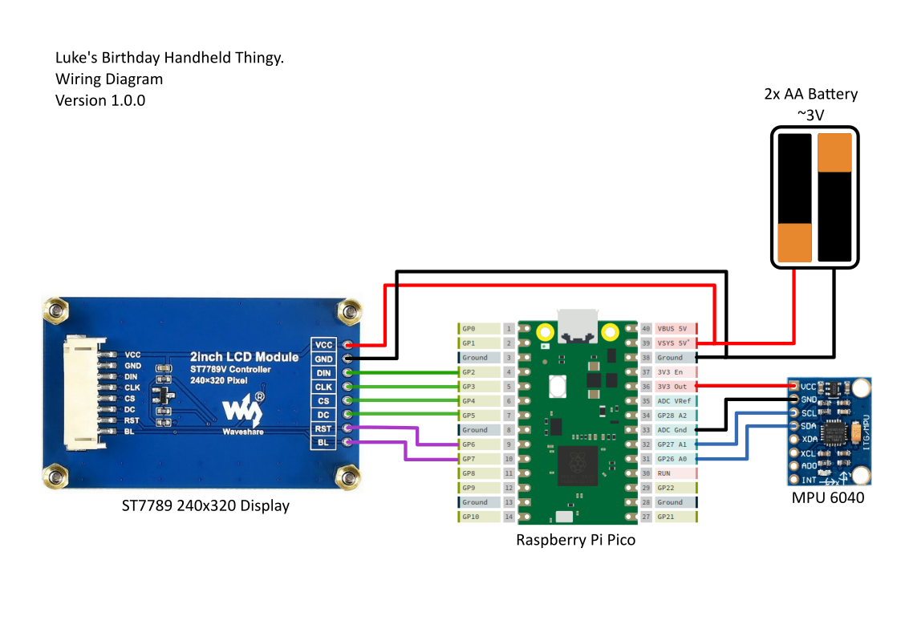

# Happy Birthday Luke!
## Documentation covering the very janky handheld device I built you

For a programming introduction, see the readme.md file in the programming folder.

## Device Overview
The microcontroller used in the handheld is the Raspberry Pi Pico, based on the rp2040 chip. However, I cut off roughly 30% of the board to make it fit better in the device. Physical pins 15-26 have been removed. This still leaves access to a solid number of GPIO pins and two interfaces to the SPI and I2C (I squared C) busses. One SPI interface is in use for the lcd (screen) and one I2C interface is used for the IMU (inertial measurement unit, essentially senses direction). The pico’s pinout:

The display used is a 240x320 2 inch LCD made by a suspicious Chinese company called waveshare. Their documentation can be found here but it doesn’t make much sense. Thankfully it uses a generic ST7789 display controller so there are plenty of libraries and documentation available. Note that the display is native to landscape, but most libraries will let you have it act as a portrait. The display’s pinout:

The IMU (short for inertial measurement unit) is an MPU-6050, a fairly common IMU. It has an accelerometer, a gyroscope, and a temperature sensor. The temperature sensor will not be very effective since the board is sandwiched behind the display, which generates a noticeable amount of heat. The accelerometer and gyroscope can be used to detect movement and rotation (and gravity too, it can be useful for finding orientation). The IMU’s Pinout	

Finally, the whole thing is powered by two AA batteries. These produce around 3-3.2V and there are no overcurrent / reverse current protection circuits in place. If you ever start modifying this thing, probably change the battery system to some 18650 LiPos and a proper charging circuit. But that is kinda off topic… Just note that the raspberry pi’s power management circuit will boost it up to 3.3v and everything will run ok, albeit the display might have a dim strobing effect. Take the batteries out before connecting the PICO to USB, otherwise they will be fed 5v.

Here is a diagram of the wiring. When you're programming, the colored number is the one you will use, not the physical pin number. For example, the I2C connection with the IMU will use pins 26 and 27.

Great! Now you have a basic understanding of the device's components and layout.
If you'd like to get started coding, check out the `Programming` folder.
For more in depth datasheets and schematics see the Hardware folder.